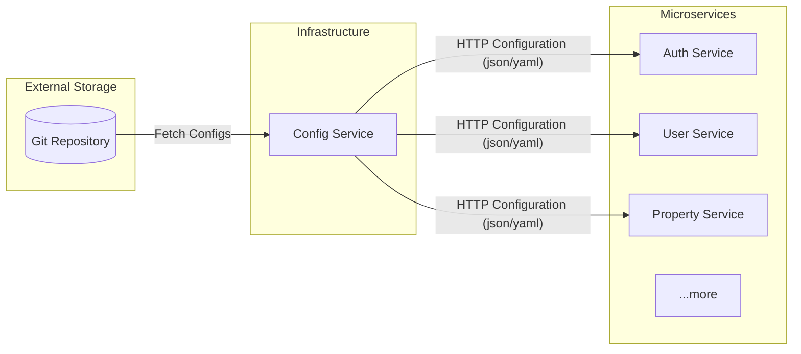

# Config Service - Centralized Configuration Management

This microservice acts as a **Spring Cloud Config Server**, providing a centralized configuration management system for all microservices in the RealEstate-Rental project ecosystem.

## 📋 Role & Purpose

In a microservices architecture, managing configurations for each service individually can be cumbersome. The **Config Service** solves this by:
- Centralizing all configuration files in a single Git repository.
- Serving these configurations to client microservices over HTTP.
- Allowing configuration updates without needing to rebuild or restart the Config Server itself.

## 🏗️ Architecture Flow

The following diagram illustrates how the Config Service interacts with the Git repository and other microservices:

## 🛠️ Technical Details

- **Port**: `8888`
- **Technology Stack**:
    - [Spring Boot 3.5.8](https://spring.io/projects/spring-boot)
    - [Spring Cloud Config Server](https://spring.io/projects/spring-cloud-config)
- **Configuration Source**: Retrieves properties from the [config-repo-estate-rental](https://github.com/ahyahya1616/config-repo-estate-rental) repository.

## 🚀 How to Use

1. **Client Setup**: Microservices (clients) must include the `spring-cloud-starter-config` dependency.
2. **Bootstrap**: Configure `spring.cloud.config.uri=http://localhost:8888` in the client's `application.yml` or `bootstrap.yml`.
3. **Endpoint**: You can manually check configurations by accessing:
   `http://localhost:8888/{application}/{profile}[/{label}]`
   Example: `http://localhost:8888/auth-service/default`

